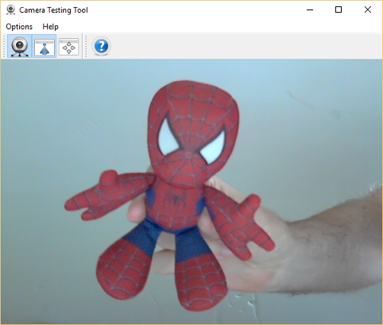

# CamTest - A simple webcam application

This is a simple webcam application mainly used to test the installation and building of Qt and OpenCV both in Windows and Linux - but I suppose it also works as a testing tool for webcams. :)

## Dependences

The application has been developed and tested with:

- Qt 5.7.0 32-bit
- OpenCV 2.4.13 32-bit
- CMake 3.5.1

## Building

1. Use CMake to configure and generate the environment. I suggest using the folder `build`, since it is the one ignored by gitignore.
2. In Windows, open the Visual Studio solution and build as desired (*debug*, *release*, etc).
3. In Linux, use type `make` to let the Makefile produce the binary.
4. The code produces only a single executable named `camtest(.exe)`, that depends on Qt and OpenCV dynamic libraries.
5. The CMake script also allows for installing and packaging.

In case of difficulties generating the environment with CMake, verify if the environment variables are correctly set (`OpenCV_DIR` and `QT5<Module>_DIR`) and consult the documentation:

- [Qt5 CMake Manual](http://doc.qt.io/qt-5/cmake-manual.html)
- [Using OpenCV with gcc and CMake](http://docs.opencv.org/2.4/doc/tutorials/introduction/linux_gcc_cmake/linux_gcc_cmake.html)

## Credits

Copyright (C) 2016 [Luiz Carlos Vieira](http://www.luiz.vieira.nom.br). Available under GPL (see details in the license file).

The icons used by the application are either from or based on the Oxygen Icons Set, downloaded as [PNGs from Felipe Azevedo (pasnox)](https://github.com/pasnox/oxygen-icons-png) and [licensed under LGPL from KDE](https://techbase.kde.org/Projects/Oxygen/Licensing).